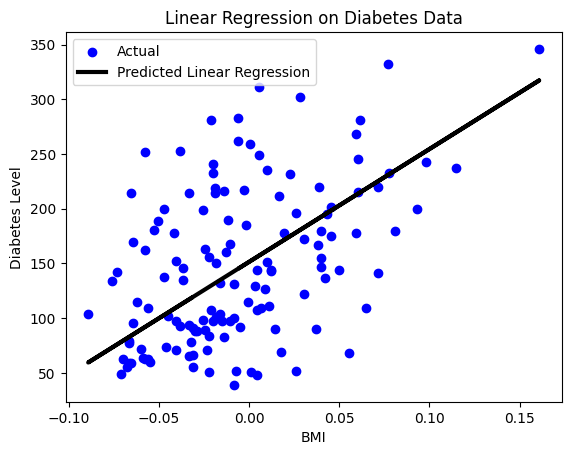

# 🧪 Diabetes Progression Prediction

This project demonstrates a simple **Linear Regression** model to predict **diabetes disease progression** using the **Body Mass Index (BMI)** feature from the built-in **scikit-learn diabetes dataset**.

---

## 📌 Objective

To build a linear regression model that predicts disease progression based on BMI and evaluate the model's performance using visualization and error metrics.

---

## 🗂️ Project Workflow

1. **Load Dataset**  
   The diabetes dataset is loaded from `sklearn.datasets`.

2. **Feature Selection**  
   - **Independent Variable**: BMI  
   - **Dependent Variable**: Disease progression

3. **Data Splitting**  
   The dataset is split into **training** and **testing** sets.

4. **Model Training**  
   A **Linear Regression** model is trained using the training data.

5. **Model Interpretation**  
   - Model **coefficients** and **intercept** are printed.  
   - **Predictions** are made on the test data.

6. **Model Evaluation**  
   - **Mean Squared Error (MSE)** is calculated to evaluate prediction accuracy.

7. **Visualization**  
   - A **scatter plot** of actual vs predicted values is created.  
   - A **regression line** is added to visualize the model’s performance.

---

## 📊 Output Plot

The following plot visualizes the linear regression model's fit on the BMI vs. disease progression data:



---

## 📦 Dependencies

Make sure the following Python libraries are installed:

```bash
pip install pandas numpy matplotlib seaborn scikit-learn
